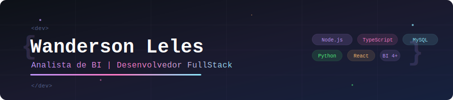

  

---

Analista de Business Intelligence com mais de 4 anos de experiência, formado em Análise Clínicas e atualmente cursando Banco de Dados. Apaixonado por transformar dados em decisões estratégicas, atuo com extração, modelagem e visualização de dados, além do desenvolvimento de APIs robustas. Minhas principais stacks incluem Javascript, Node.js, TypeScript, React, MySQL e Python.

---

### 🤖 Linguagens e Tecnologias

 
 

---

### 📬 Contato

